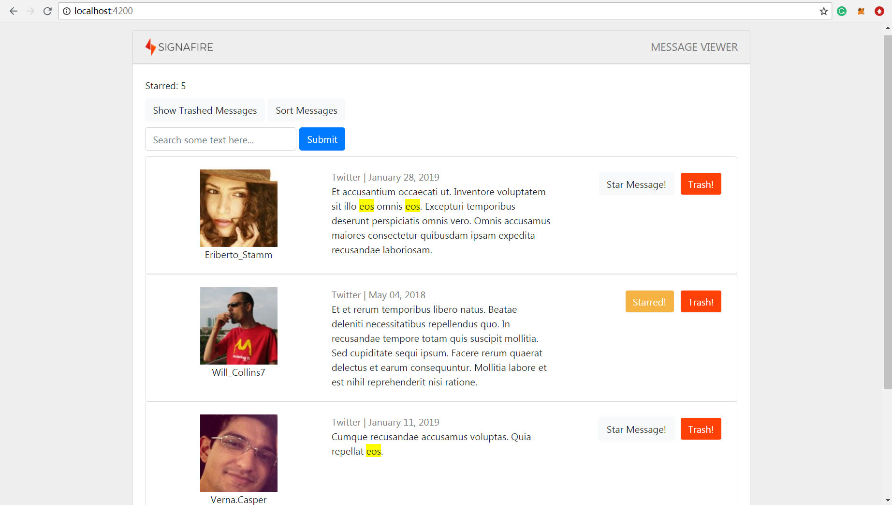

### Usage
Server runs at localhost:6666
Client runs at localhost:4200
To start server
```bash
cd ./src/server
node server.js
```
To start client
```
cd ./src/messageviewer
npm start
```
To run mysql on localhost
```bash
MYSQL_Path$ mysqld
mysql -u root -p
password
```
### Screenshot

